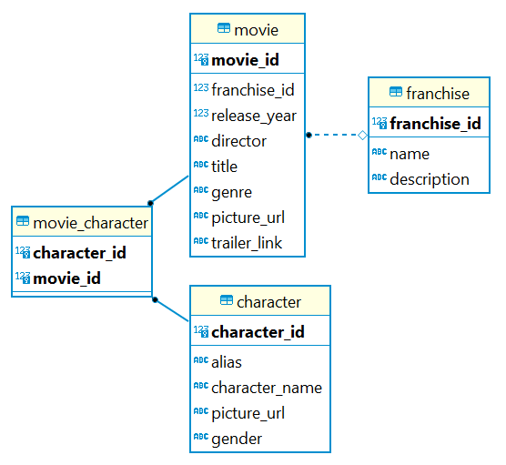

# Film API
Film API is a RESTful API containing a datastore and an interface allowing users to store and manipulate movies, characters and franchises. The application constructed in Spring Web is comprised of database created through Hibernate. The data consists of movie information such as the title, director, genres, poster picture and trailer link. A movie can have multiple characters playing in the movie as well as potentially being a part of a franchise. A character has a name as well as an alias, picture and gender. Characters can play in several movies. Franchises has a name, a description and has a collection of multiple movies.

  
Picture 1. ER Diagram of the database created with Hibernate

  
## Java Installation Guide

### Step 1: Download Java
First download latest version of Java [Java](https://www.oracle.com/java/) to install.

### Step 2: Verify Installation
Open a new command prompt (or terminal) and type:

```bash
java --version
```
This should display Java's version, indicating a successful installation.

## Maven Installation Guide

### Step 1: Download Maven
First download the latest version of Maven [Maven](https://maven.apache.org/download.cgi).

### Step 2: Installed Maven
Extract the downloaded file to a suitable location on your computer.

### Step 3: Add Maven To Path
To run Maven in your command line, you need to add Maven bin in your system `PATH` variable.

Windows: 
1. Right click on `This PC` and choose `Properties`.
2. Click on `Advanced system settings`
3. Click on `Environment Variables`.
4. Under System Variables, locate `PATH` and click `Edit`.
5. Click `New` and add the path to Maven's bin

Mac:
Add the following line to your .bashrc, .bash_profile, or .zshrc, depending on your shell:
```bash
export PATH=$PATH:/path/to/maven/bin
```
Replace /path/to/maven with the actual path where you extracted Maven.

### Step 4: Verify Installation
Open a new command prompt (or terminal) and type:

```bash
mvn --version
```

This should display Maven's version, indicating a successful installation.


## Database

- A relational database management system (RDBMS) supporting SQL, suggestively PostgreSQL


## Configuration

To clone this application run the following command in your terminal:
```bash
git clone https://github.com/98emre/Film-API
```


### Dependencies in your application.properties file

Make sure all you have all of the following dependencies in your pom.xml file and use the latest version:
- spring-boot-starter
- spring-boot-starter-data-jpa
- spring-boot-starter-actuator
- spring-boot-starter-web
- spring-boot-starter-test
- springdoc-openapi-starter-webmvc-ui
- postgresql (make sure to change this dependency in case you use another relational database management system)
- lombok
- mapstruct
- mapstruct-processor

  
As well as verifying that your maven plugin version exists and is not later than your installed maven version.

  
In the application.properties file, to configure to your database, set your environment variables alternatively set them explicitly:
```
spring.datasource.url=${POSTGRES_URL}
spring.datasource.username=${POSTGRES_USERNAME}
spring.datasource.password=${POSTGRES_PASSWORD}
```

  
When mapping and seeding the database and running the application for the first time, make sure this property is set to create:
```
spring.jpa.hibernate.ddl-auto=create
```

When mapping and seeding is completed set the property to update:
```
spring.jpa.hibernate.ddl-auto=update
```

  
## Usage
The application will run on port 8080 by default. 
If another port would be desired, this can be set in the application.properties file.
  

### API Endpoints

#### Movie
| HTTP Verbs | Endpoints | Action |
| --------- | --------- | --------- |
| POST | /api/movies/add | To create a new movie |
| GET | /api/movies | To retrieve all movies on the platform |
| GET | /api/movies/:movieId | To retrieve details of a single movie |
| GET | /api/movies/:movieId/characters | To retrieve all characters of a single movie |
| PATCH | /api/movies/update/:movieId | To edit the details of a single movie |
| DELETE | /api/movies/delete/:movieId | To delete a single movie |

#### Character
| Character |
| --------- | --------- | --------- |
| HTTP Verbs | Endpoints | Action |
| --------- | --------- | --------- |
| POST | /api/characters/add | To create a new character |
| GET | /api/characters | To retrieve all characters on the platform |
| GET | /api/characters/:characterId | To retrieve details of a single character |
| PATCH | /api/characters/update/:characterId | To edit the details of a single character |
| DELETE | /api/characters/delete/:characterId | To delete a single character |


#### Franchise
| HTTP Verbs | Endpoints | Action |
| --------- | --------- | --------- |
| POST | /api/franchises/add | To create a new franchise |
| GET | /api/franchises | To retrieve all franchises on the platform |
| GET | /api/franchises/:franchiseId | To retrieve details of a single franchise |
| GET | /api/franchises/:franchiseId/movies | To retrieve all movies of a single franchise |
| GET | /api/franchises/:franchiseId/movies/characters | To retrieve all characters of all the movies of a single franchise | 
| PATCH | /api/franchises/update/:franchiseId | To edit the details of a single franchise |
| DELETE | /api/franchises/delete/:franchiseId | To delete a single franchise |

## Authors
Emre Demirel @98emre

Nathalie Levenfalk @levenfalk  

  
## License
This project is available for use under the [MIT License](https://choosealicense.com/licenses/mit/) 
