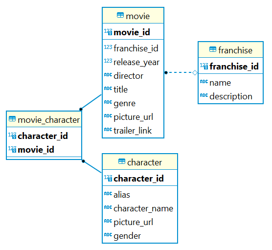

# Film API
Film API is a RESTful API containing a datastore and an interface allowing users to store and manipulate movies, characters and franchises. The application constructed in Spring Web is comprised of database created through Hibernate. The data consists of movie information such as the title, director, genres, poster picture and trailer link. A movie can have multiple characters playing in the movie as well as potentially being a part of a franchise. A character has a name as well as an alias, picture and gender. Characters can play in several movies. Franchises has a name, a description and has a collection of multiple movies.


Picture 1. ER Diagram of the database created with Hibernate

## Installation

### Prerequisites

- Java 17 or later version and any supporting IDE, suggestively VSCode or IntelliJ
- A relational database management system (RDBMS) supporting SQL, suggestively PostgreSQL
- Maven version 3.8.1  or later

### Configuration

To clone this application run the following command in your terminal:
```bash
git clone https://github.com/98emre/Film-API
```

#### In your application.properties file
To configure to your database, set your environment variables alternatively set them explicitly:
```
spring.datasource.url=${POSTGRES_URL}
spring.datasource.username=${POSTGRES_USERNAME}
spring.datasource.password=${POSTGRES_PASSWORD}
```

When mapping and seeding the database and running the application for the first time, make sure this property is set to create as well as...:
```
spring.jpa.hibernate.ddl-auto=create

spring.sql.init.platform=postgres
spring.jpa.defer-datasource-initialization=true
spring.sql.init.mode=always
```

When mapping and seeding is completed set the property to ...
```
spring.jpa.hibernate.ddl-auto=...
```

## Usage
The application will run on port 8080 by default (?)

### API Endpoints
| HTTP Verbs | Endpoints | Action |
| --- | --- | --- |
| POST | /api/movie/add | To create a new movie |
| POST | /api/character/add | To create a new character |
| POST | /api/franchise/add | To create a new franchise |
| GET | /api/movie | To retrieve all movies on the platform |
| GET | /api/character | To retrieve all characters on the platform |
| GET | /api/franchise | To retrieve all franchises on the platform |
| GET | /api/movie/:movieId | To retrieve details of a single movie |
| GET | /api/character/:characterId | To retrieve details of a single character |
| GET | /api/franchise/:franchiseId | To retrieve details of a single franchise |
| PATCH | /api/movie/update/:movieId | To edit the details of a single movie |
| PATCH | /api/character/update/:characterId | To edit the details of a single character |
| PATCH | /api/franchise/update/:franchiseId | To edit the details of a single franchise |
| DELETE | /api/movie/delete/:movieId | To delete a single movie |
| DELETE | /api/character/delete/:characterId | To delete a single character |
| DELETE | /api/franchise/delete/:franchiseId | To delete a single franchise |

## Authors

@levenfalk
@98emre

## License
This project is available for use under the MIT License